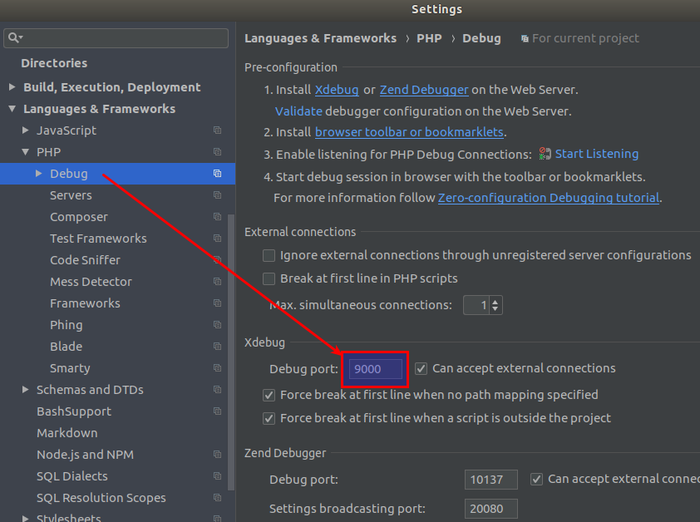
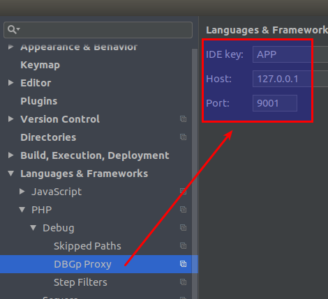
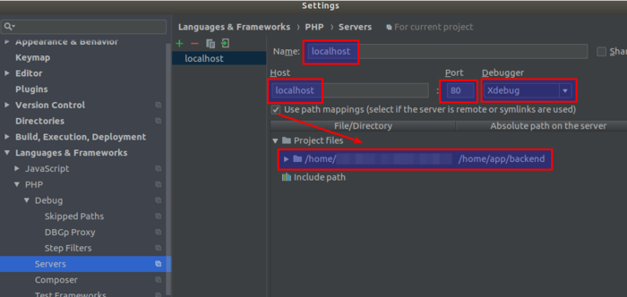
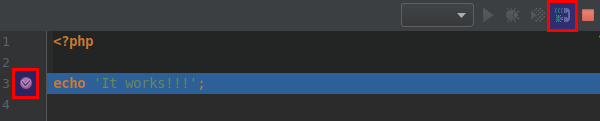

Настройка xdebug в PhpStorm
===========================
1. В `.env` файле, в переменной `HOST_MACHINE_IP` укажите ваш IP адрес. Он нужен для дебага консольных скриптов.
2. Настройте PhpStorm:
  
  
  
3. Включите прослушку и пользуйтесь.
  